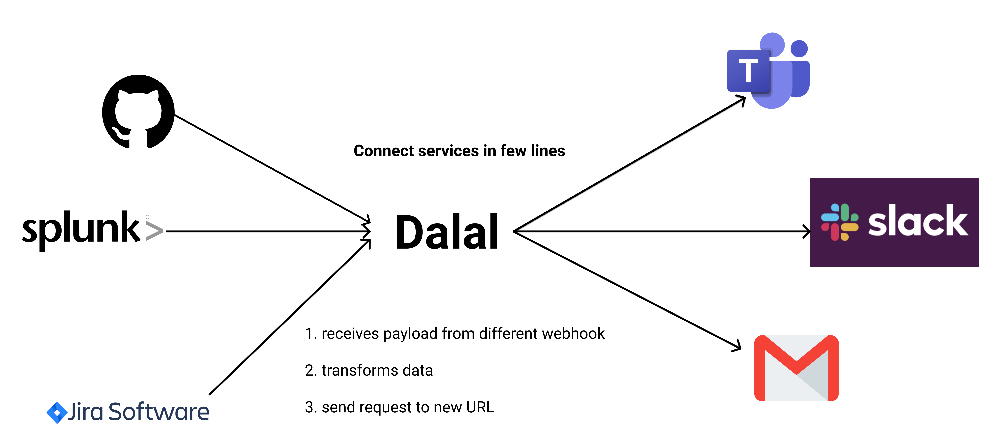

<!-- PROJECT LOGO -->
<br />
<div align="center">
  <h1>🦹 Dalal UI 🦹</h1>

  <p align="center">
    <b>Frontend for <a href="https://github.com/ghostwriternr/dalal" target="_blank" rel="noopener noreferrer">Dalal</a></b>
    <br/>
    <b>The BYOL* Payload Transormation Service</b>
    <br /><br />
    <a href="https://www.usedalal.com"><strong>Try it out »</strong></a>
    <br /><br />
    <a href="https://github.com/ghostwriternr/dalal-ui/issues">Report Bug</a>
    ·
    <a href="https://github.com/ghostwriternr/dalal-ui/issues">Request Feature</a>
  </p>
  
</div>

## Table of Contents

-   [About the Project](#about-the-project)
    -   [Built With](#built-with)
-   [Usage Instructions](#usage-instructions)
-   [Getting Started](#getting-started)
    -   [Prerequisites](#prerequisites)
    -   [Running Dalal UI locally](#running-dalal-ui-locally)
-   [Contributing](#contributing)
-   [Credits](#credits)

## About The Project


Dalal is a powerful, in-flight webhook transformation service to connect absolutely any 2 services with very few lines of code - writen in your favourite language!

To know more about the core service, head to the [Dalal](https://github.com/ghostwriternr/dalal) repo.

### Built With

-   [React](https://reactjs.org/) with [TS](https://www.typescriptlang.org/) & [Styled Components](https://styled-components.com/)
-   [Ant Design](https://ant.design/docs/react/introduce) and [Nivo](https://nivo.rocks/)

## Usage Instructions

1. Create a new channel from the home page.
2. Write a transformation function in any language desired, which will take in the data passed when the webhook is called, and use that to forward the data to desired service in the required format.
3. Add the url of the desired service, where you want to forward the request, in the target URL.
4. Click on Save.

## Getting Started

### Prerequisites

-   [`yarn`](https://classic.yarnpkg.com/en/docs/install/) (or [`npm`](https://docs.npmjs.com/downloading-and-installing-node-js-and-npm), in which case, replace all instructions below with `npm` instead of `yarn`)

### Running Dalal UI Locally

1. Clone the repo

```sh
git clone git@github.com:ghostwriternr/dalal-ui.git
```

2. Install NPM packages

```sh
yarn install
```

3. Start the local development server

```sh
yarn start
```

<!-- CONTRIBUTING -->

## Contributing

Contributions to Dalal are always welcome and all contributions you make are **greatly appreciated**. If you need clarifications, please [create an issue](https://github.com/ghostwriternr/dalal-ui/issues/new).

1. Fork the Project
2. Create your Feature Branch (`git checkout -b feature/AmazingFeature`)
3. Commit your Changes (`git commit -m 'Add some AmazingFeature'`)
4. Push to the Branch (`git push origin feature/AmazingFeature`)
5. Open a Pull Request

## Credits

-   [shubhamjain148 / Shubham Jain](https://github.com/shubhamjain148)
-   [mukul13 / Mukul Chaware](https://github.com/mukul13)
-   [ghostwriternr / Naresh Ramesh](https://github.com/ghostwriternr)

Built with love, empathy and superpowers 🌺
